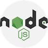
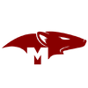
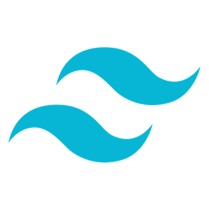

# Meet 'N Eat

🤔 Ever found the perfect restaurant, but had no one to go with? Ever wanted to meet someone based on your love of food? 

🍽 Meet 'n Eat is an app that helps match people who have common tastes! The platform allows users to add friends and send DMs, as well as schedule and track meetups from their profile page. On top of that users can browse available restaurants and get information such as reviews and other users who have liked that restaurant.

## Deployed Website Link

Head over to () to view more!

## 🧑🏼‍💻👩🏻‍💻🧑🏻‍💻 Authors

* **Andrew Rethorford** - [GitHub](https://github.com/andrewretherford)
* **Aimee Misaki** - [GitHub](https://github.com/aimeemisaki)
* **David Sandoval** - [GitHub](https://github.com/DavidJoao)

## 🧰 Tech Stack

## Features
* Create an account and sign back in with user authentication
* Search restaurants with keywords and add various search filters
* View restaurant information, reviews left by other users and send friend requests to other users who have favorited the restaurant
* Add restaurant to favorites and add reviews
* Accept/decline friend requests
* Send event invites to other users with date/time and restaurant of choice
* View and edit itinerary (events with other users)
* View messages and send messages to friends in chat
* View friends and their basic information
* View and remove favorited restaurants
* Edit user profile (incl. profile photo, 'About Me' section, etc.)

# Planning 

## 💡 Our Approach

Our group project application, for which we built our first version during our Software Engineering Intensive program at General Assembly, we utilized the Scrum methodology, assigning roles of Product Owner, Scrum Master and Development representatives to each of our project members. First, we began with each member coming up with his/her/their own user stories with the Product Owner's vision of the application in mind. We, then, conglomerated our ideas and organized our first draft of our project's user stories and general framework of the application's functionalities. 

In order to cohesively plan our backend that could support our frontend, we created a spreasheet of schemas and backend routes - taking into consideration our use of Mongoose, MongoDB and Express - and subsequently built an entity-relationship model. 

For our frontend planning, each member drafted wireframes, which we consolidated into one set of wireframes that we, especially the Product Owner, believed met the standards of the product's value. Furthermore, we constructed a component heirarchy, mapping out the network of parent, children and sibling components, and included a table of each component with its name, description, frontend route (if required) and whether it was a state or props (if applicable).

**We completed our first version in less than two weeks, which included three sprints - one to build the backend, one to build the frontend functionalities and one to complete styling.**

**_Although we passed not only the project's MVP set by our program's guidelines, but also a few of our own stretch goals, we were eager to further improve our application and see our own skills as fullstack software engineers to its fullest potential._**

Thus, after the program ended, we first identified the frontend functionality and backend inefficiencies we did not have time to work on during our time at General Assembly and essentially began from scratch. We, then, began with a completely new set of wireframes that would embody everything we wanted for our application. Subsequently, we remodeled our component heirarchy and table according to our new frontend functionality requirements.  

While maintaining most of our schemas/models in our backend, we reconfigured our controllers with more efficient ways to send back specific bodies of data to the frontend that were integral for each component. For our frontend, we built out all of the functionality we laid out in our component heirarchy and redesigned our whole styling, including responsive design, using TailwindCSS. 

Although we all had different schedules and oftentimes were in completely different timezones, we maintained the Scrum methodology and contributed our time and skills to build this application.

**In total, we worked for over six weeks, compartmentalized by three sprints (one for MVP, one for polishing up all functionality and one for styling and error handling), with bi-weekly, if not daily, standup Zoom calls and continous Slack communication. We also organized our work by utilizing team boards via Trello to keep track of which components required work to be done on, which team member was currently working on which component and which component was finished.**

**_Our general approach after the program ended was asking ourselves, "What is missing? What do we need to fix?" Ultimately, however, our approach to all of these questions relied on teamwork and each member's hard work and dedication to enhance our project. We are grateful for this experience and hope you all get to enjoy Meet N' Eat._**

## 🧩 Entity-relationship model

## 🔎 Component Heirarchy 

## 📝 User Stories

 - As a User, I want to be able to make a profile in order to store details about myself																
 - As a User, I want to be able to view other users who are interested in the restaurants that I like so that I can invite them to check it out				
 - As a User, I want to be able to view details about other users in their profile so that I can make better decisions about who to meet up with																
 - As a User, I want to be able to save a list of restaurants that I like so that I can keep track of them																
 - As a User, I want to see relevant details of restaurants such as ratings, prices, type of food on the menu, business hours, etc so that I can decide which ones I like																
 - As a User, I would like the ability to leave reviews for restaurants that I've been to in order to help the community with feedback																
 - As a User, I want to be able to search restaurants by location so that I can make decisions which restaurants to visit based on travel time																
 - As a User, I want to be able to search restaurants by certain attributes, such as genre, price, etc to help me narrow down the choices																
 - As a User, I want to be able to search by multiple attributes at once so that I don't have to search separately for each	
 - As a User, I want to be able to schedule meetups and invite other users to them from my profile in order to keep track of who I'm meeting, when I'm meeting them, and where we're going		
 - As a User, I want to be able to send friend request to other people to keep track of the people I want to meet with

## 🖌 Wireframes
* Home

* SignUp

* CoordinateMeetup (MyPage)

* Favorites (MyPage)

* Friends (MyPage) 

* Itinerary (MyPage)

* Messages

* MessageChat

* SearchResults

* FriendRequests

## 👀 Sreenshots
* MyPage (Desktop)

* Navigation (Mobile)

* MessageChat (Mobile)

## 🏃 Stretch Goals / Future Plans

